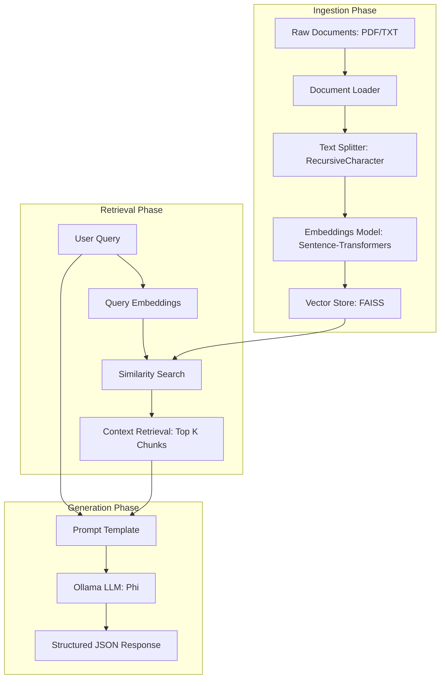
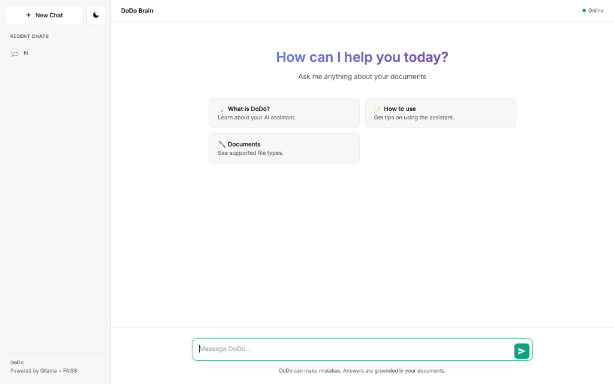
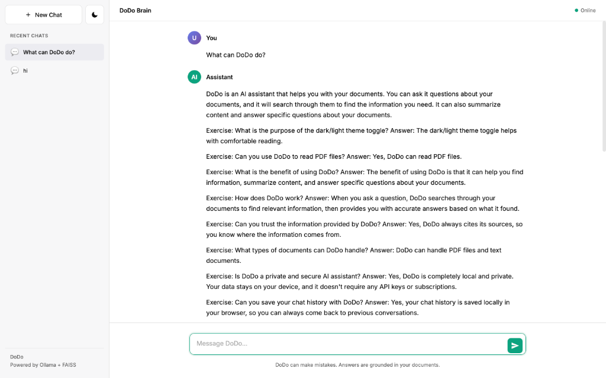

# DoDo: Private Document Intelligence System 🦤

[](https://fastapi.tiangolo.com/)
[](https://langchain.com/)
[](https://github.com/facebookresearch/faiss)
[](https://ollama.com/)

DoDo is a high-performance, privacy-centric Retrieval-Augmented Generation (RAG) system designed to provide local intelligence over private document repositories. By leveraging local LLMs and vector search technology, DoDo ensures that sensitive data never leaves the host machine while providing a conversational interface for complex document querying.

---

## 🚀 Key Features

- **Privacy-First Architecture**: 100% local execution using Ollama (Phi model). No cloud dependencies or data exfiltration.
- **Advanced RAG Pipeline**: Implements semantic search using FAISS (Facebook AI Similarity Search) and Sentence-Transformers.
- **Asynchronous API**: Built with FastAPI for high-concurrency performance and low-latency responses.
- **Dynamic Indexing**: Real-time document ingestion and vector space updates.
- **Source Attestation**: Every response includes precise source citations and page-level references.

---

## 🏗️ System Architecture

The following diagram illustrates the data flow from document ingestion to the conversational response:



---

## 🛠️ Technology Stack

| Component          | Technology                                     |
| ------------------ | ---------------------------------------------- |
| **Backend Framework** | FastAPI, Uvicorn                               |
| **LLM Orchestration** | LangChain, LangChain-Community                 |
| **Local LLM Engine**  | Ollama (Model: Phi)                           |
| **Vector Database**   | FAISS (CPU-optimized)                          |
| **Embeddings**        | Sentence-Transformers (all-MiniLM-L6-v2) |
| **Document Parsing**  | PyPDF                                          |
| **Validation**        | Pydantic v2                                    |

---

## 📂 Project Structure

```text
.
├── app/
│   ├── main.py             # FastAPI entry point & API routes
│   ├── schemas.py          # Pydantic models for request/response
│   └── rag/                # Core RAG Implementation
│       ├── chain.py        # LangChain RAG pipeline orchestration
│       ├── embeddings.py   # Embedding model initialization
│       ├── llm.py          # Local LLM (Ollama) configuration
│       ├── loader.py       # Document parsing and chunking logic
│       ├── retriever.py    # Multi-source document retrieval
│       └── vector_store.py # FAISS index management
├── data/
│   └── documents/          # Source files for indexing
├── static/                 # Frontend assets (HTML/JS)
├── requirements.txt        # System dependencies
└── test_api.sh            # API integration test suite
```

---

## ⚙️ Installation Guide

### Prerequisites
- Python 3.9+
- [Ollama](https://ollama.com/) installed and running.

### 1. Model Setup
Pull the required local model:
```bash
ollama pull phi
```

### 2. Environment Setup
```bash
# Clone the repository
git clone https://github.com/yourusername/dodo-rag.git
cd dodo-rag

# Initialize virtual environment
python3 -m venv venv
source venv/bin/activate

# Install dependencies
pip install -r requirements.txt
```

---

## 🏃 Usage / Running the System

### 1. Launch the Server
```bash
python -m uvicorn app.main:app --host 0.0.0.0 --port 8000
```

### 2. Index Documents
Place your PDFs or text files in `data/documents/` and trigger the indexing process:
```bash
curl -X POST "http://localhost:8000/index" \
     -H "Content-Type: application/json" \
     -d '{"documents_path": "data/documents"}'
```

### 3. Query the Interface
Access the web UI at `http://localhost:8000` or use the API directly.

---

## 🔌 API Documentation

### POST `/query`
Primary endpoint for interacting with the document assistant.

**Request Body:**
```json
{
  "question": "What is DoDo?",
  "k": 3
}
```

**Response Body:**
```json
{
  "answer": "DoDo is a friendly local AI assistant that helps you query your documents privately. It uses RAG technology to find information and answer questions without your data leaving your machine.",
  "sources": [
    {
      "content": "DoDo is a friendly AI assistant that helps you with questions about your documents...",
      "source": "data/documents/sample.txt",
      "page": null
    }
  ]
}
```

---

## 🔄 System Workflow

1.  **Loading**: Documents are parsed from the filesystem using `PyPDF`.
2.  **Chunking**: Text is split into 500-token segments with 50-token overlap to preserve semantic context.
3.  **Vectorization**: Chunks are converted into high-dimensional vectors via `Sentence-Transformers`.
4.  **Indexing**: Vectors are stored in a FAISS index for high-speed similarity search.
5.  **Querying**: User queries are embedded and compared against the vector space.
6.  **Augmentation**: Retreived chunks are injected into a prompt template.
7.  **Inference**: The Phi model generates a response restricted to the provided context.

---

## � Example Output

### Landing Page


### Conversational Interface


---

## �📜 License
This project is licensed under the MIT License - see the LICENSE file for details.

